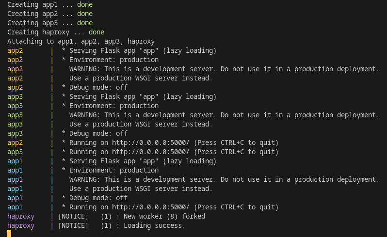

# Docker HAProxy Playground

This is a project to be used as an HAProxy lab environment, allowing communication between HAProxy and backend application services.

## **Context**
The purpose of this project is basically to build a frontend x backend structure served by docker containers.

For this lab, the following tools were used:

* **Docker/docker-compose:** The main challenge here was coming up with a way to configure haproxy so that it could communicate with backends through containers layer.

* **Frontend:** 
  * Offical Docker [Haproxy 2.6](https://hub.docker.com/_/haproxy/\)/).
  * HAPROXY custom configuration (`haproxy.cfg`) in Haproxy confs folder.
* **Backends:** 
  * [My personal Flask Python Image](https://hub.docker.com/r/alexmbarbosa/flask-python3).
  * Simple flask code (`app.py`) + requirements in Flask app folder.

## Project Structure
```bash
.
├── docker-compose.yml
├── files
│   ├── app
│   │   ├── app.py
│   │   ├── Dockerfile
│   │   └── requirements.txt
│   └── haproxy
│       ├── confs
│       │   ├── haproxy.cfg
│       │   └── haproxy.cfg.ori
│       └── Dockerfile
├── LICENSE
└── README.md

4 directories, 9 files
```
___
## How to use this lab

* Clone this project:

```sh
git clone https://github.com/alexmbarbosa/haproxy-lab-dev.git
```

* Go to folder haproxy-lab-dev:

```sh
cd haproxy-lab-dev
```

* Execute docker compose:

```sh
docker-compose up -d
```



Listening port validation (`haproxy :80/ haproxy stats :1936`):

```sh
❯ netstat -lptn | grep -E ':80|:1936'

tcp        0      0 0.0.0.0:80              0.0.0.0:*               LISTEN      -                   
tcp        0      0 0.0.0.0:1936            0.0.0.0:*               LISTEN      -                   
tcp6       0      0 :::80                   :::*                    LISTEN      -                   
tcp6       0      0 :::1936                 :::*                    LISTEN      -
```

Request validation (Port 80):

```sh
❯ curl localhost
Hello from FLASK. My Hostname is: 32f3322dfb4b 
❯ curl localhost
Hello from FLASK. My Hostname is: b9cb0fd7af21 
❯ curl localhost
Hello from FLASK. My Hostname is: a4128b71361c
```

---
### **Author:** Alex Mendes

**LinkedIn:** https://www.linkedin.com/in/mendesalex/

### **References:**

* [How to Run HAProxy with Docker](https://www.haproxy.com/blog/how-to-run-haproxy-with-docker/)
* [Docker Container networking](https://docs.docker.com/config/containers/container-networking/)
* [HAProxy Configuration Basics](https://www.haproxy.com/blog/haproxy-configuration-basics-load-balance-your-servers/)
* [HAProxy - Four Essential Conf Sections](https://www.haproxy.com/blog/the-four-essential-sections-of-an-haproxy-configuration/)
